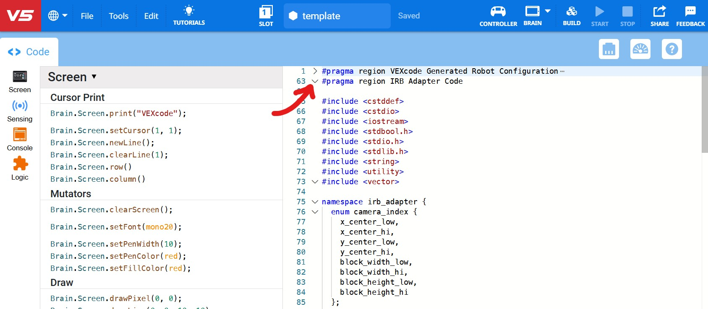

# SJSU E10 IRB to VEX Brain 5 Adapter

The code in this repo contains the firmware for the adapter, as well as an
example and a template to be used on the Vex located in the `/vex-code/`
folder. The files in the vex-code folder are to be used in the [Vex Web Editor]
(https://codev5.vex.com/) or in VS Code with the [VEX extension](https://www.vexrobotics.com/vexcode/vscode-extension).

## Getting Started (Writing Code for Vex)

To get access to the starter files on your computer you can download everything
by clicking the Green `🟩 Code <>` drop down button on the top of the page, and
navigate to the `Download Zip` button to download a zip of this project.

### Using CodeV5 by VEX (RECOMMENDED)

> [!IMPORTANT]
> To use this tool, you **MUST** use a Chrome based browser:
>
> - Google Chrome
> - Chromium
> - Microsoft Edge
> - Opera GX (supports WebSerial)

Here is a link to the web based development software:
[CodeV5 By Vex](https://codev5.vex.com/). To open the starter project navigate,
from the web interface, select "File" then "Open" then navigate to the location
where you installed this project and open the `vex-code/` folder and select `template.v5cpp`.

The downward facing arrow next to `#pragma region IRB Adapter Code` can be clicked to collapse the helper
class for a cleaner view.


### Using Visual Studio Code (VSCode)

You can also use [Visual Studio Code](https://code.visualstudio.com/) to write
software for the VEX5 Brain.

- Install the [Vex Robotics](https://marketplace.visualstudio.com/items?itemName=VEXRobotics.vexcode) extension.
- Open the Vex extension tab in VSCode and select "Import Project"
- Find the downloaded project and select `template.v5cpp`.

## Requesting and Receiving Data With Helper Code

The template provides a helper class and functions to assist in asking for data
from the adapter. They each return a struct containing the needed data and are
further explained below.

#### Low Frequency IR Data

```C++
const int port_number = 1;
e10::adapter board(port_number);
```

Assuming the above code exists in your project, then you can do the following:

```c++
auto const measurement = board.get_low_ir();
auto const direction = measurement.direction(); // photo diode index from 0 to 7
auto const intensity = measurement.intensity(); // signal strength from 0 to 127
```

#### High Frequency IR Data

```C++
const int port_number = 1;
e10::adapter board(port_number);
```

Assuming the above code exists in your project, then you can do the following:

```c++
auto const measurement = board.get_high_ir();
auto const direction = measurement.direction(); // photo diode index from 0 to 7
auto const intensity = measurement.intensity(); // signal strength from 0 to 127
```

### AI Camera Data

```C++
const int port_number = 1;
e10::adapter board(port_number);
```

Assuming the above code exists in your project, then you can do the following:

```c++
auto const object = board.get_detected_object();
auto const x = object.x_center(); // horizontal center in pixels (0-639)
auto const y = object.y_center(); // vertical center in pixels (0-479)
auto const w = object.width();    // bounding box width in pixels
auto const h = object.height();   // bounding box height in pixels
```

## About the Project

[](https://github.com/libhal/vex-irb-adapter/actions/workflows/build.yml)

This project is an adapter for the SJSU E10 Infrared Receiver Board to allow
communication with Vex 5 brain through use of a RS485 transceiver and an RJ11
port (commonly called a smart port on VEX side). The adaptor has a PH4.0
connector which is used to communicate with the
[HuskyLens 2 AI Camera](https://www.dfrobot.com/product-2995.html).

The product design is open source. You can find the following parts:

- PCB design (OSHWLAB): https://oshwlab.com/libhal/vex-adapter
- 3v3 Power Regulator (Pololu): (https://www.pololu.com/product/5592)
- 3D printed enclosure on (OnShape):(https://cad.onshape.com/documents/ee69ea771b3426ac97776444/w/45ac0aa7c9bd20a1984d74b6/e/4c369e0476760c7468856e8b?renderMode=0&uiState=68d6b1c8a8c68f57f9c83bdb)
