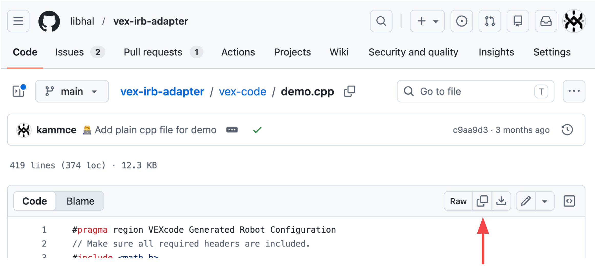
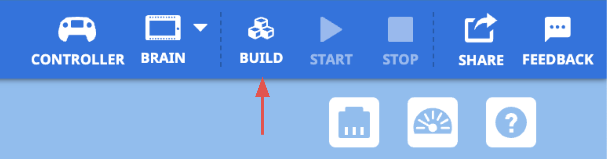

# SJSU E10 Robot Lab — VEX5 Adapter

## 📖 Table of Contents

- [SJSU E10 Robot Lab — VEX5 Adapter](#sjsu-e10-robot-lab--vex5-adapter)
  - [📖 Table of Contents](#-table-of-contents)
  - [🔍 What Is This?](#-what-is-this)
  - [💻 Writing \& Uploading Code](#-writing--uploading-code)
    - [Option A — CodeV5 by VEX *(Recommended for beginners)*](#option-a--codev5-by-vex-recommended-for-beginners)
    - [Option B — Visual Studio Code *(For those who want more control)*](#option-b--visual-studio-code-for-those-who-want-more-control)
  - [📡 Sensor API Reference](#-sensor-api-reference)
    - [Setup](#setup)
    - [IR Beacon](#ir-beacon)
    - [AI Camera](#ai-camera)
    - [Utility: Clamp](#utility-clamp)
  - [🆘 Need Help?](#-need-help)

---

## 🔍 What Is This?

This project gives your VEX V5 robot the ability to:

- 📡 **Detect IR beacons** — sense direction and strength of 1 kHz
  or 10 kHz infrared signal
- 👁️ **See with AI** — locate and track objects using the
  HuskyLens AI camera

The **E10 Adapter** board plugs into the E10 IRB sensor board on
one side and your VEX V5 Brain's smart port on the other. The
firmware and starter code in this repo do the heavy lifting so you
can focus on writing your robot's logic.

> [!NOTE]
> A github account is not needed for the steps below.

---

## 💻 Writing & Uploading Code

### Option A — CodeV5 by VEX *(Recommended for beginners)*

> [!WARNING]
> **Browser must support Web Serial!** Browsers that support this are listed
> below:
>
> - Chrome
> - Edge
> - Chromium,
> - Opera GX
> - FireFox version 151
>
> See this page for an extended list of browser support here:
> https://developer.mozilla.org/en-US/docs/Web/API/Web_Serial_API#browser_compatibility

1. Go to **[codev5.vex.com](https://codev5.vex.com/)** and create
   a new `Text` project and select `C++` as the language.
2. Go to this link **[`vex-code/starter.cpp`](vex-code/starter.cpp)**
3. Press the "Copy Raw File" Button to copy the files contents.
4. Back in CodeV5, and paste the contents of the file and press the **Build**
   button to test if the code builds.
5. Done!



<div style="text-align:center">
Figure 1. How to copy starter file to clipboard.
</div>



<div style="text-align:center">
Figure 2. Code V5 Code Build Button (on upper right hand side of website)
</div>

> [!TIP]
> Click the **▶ arrow** next to `#pragma region IRB Adapter Code`
> to expand the helper library and its contents. Press it again to collapse it
> and keep your workspace tidy.

### Option B — Visual Studio Code *(For those who want more control)*

1. Install [Visual Studio Code](https://code.visualstudio.com/)
2. Install the [VEX Robotics extension]
   (https://marketplace.visualstudio.com/items?itemName=VEXRobotics.vexcode)
3. Open the VEX tab → **New Project** (select language `C++`)
4. Open `vex-code/starter.cpp` from the downloaded folder, copy
   all its contents, and paste them into your new project's main
   file.

---

## 📡 Sensor API Reference

The `e10::adapter` class gathers **IR beacon** and **AI camera**
data from the E10 adapter board. Other sensors on your robot
(motors, bumpers, etc.) are accessed the same way you always would
in VEX.

### Setup

Declare your adapter once, near the top of your program. Replace
`1` with whichever smart port your adapter is plugged into.

```cpp
const int port_number = 1;
e10::adapter sensor(port_number);
```

A background thread starts automatically and continuously reads
data from the board — so your main loop never blocks waiting for
sensor data.

---

### IR Beacon

Returns the direction and strength of the **1 kHz** infrared
beacon signal.

```cpp
auto const measurement1 = sensor.measure_1kHz();
auto const measurement2 = sensor.measure_10kHz();
```

| Method                        | Returns | Description                                                            |
| ----------------------------- | ------- | ---------------------------------------------------------------------- |
| `measurement.direction()`     | `int`   | Strongest photo diode: **0** (left) to **7** (right). Center ≈ **3–4** |
| `measurement.intensity()`     | `int`   | Signal strength **0–127**. Below **10** is usually noise               |
| `measurement.min_direction()` | `int`   | Always **0**                                                           |
| `measurement.max_direction()` | `int`   | Always **7**                                                           |
| `measurement.min_intensity()` | `int`   | Always **0**                                                           |
| `measurement.max_intensity()` | `int`   | Always **127**                                                         |

**Example:**

```cpp
auto const measurement = sensor.measure_1kHz();

if (measurement.intensity() > 10) {
    // Beacon is visible — check which side it's on
    float center = measurement.max_direction() / 2.0f; // 3.5 = dead center
    float error  = measurement.direction() - center;   // negative = left, positive = right
}
```

---

### AI Camera

Returns bounding-box data for the object the HuskyLens camera is currently tracking.

> [!TIP]
> The camera frame is **640 × 480 pixels**. The origin `(0, 0)`
> is the **top-left** corner.

```cpp
auto const object = sensor.get_detected_object();
```

| Method                   | Returns | Description                                            |
| ------------------------ | ------- | ------------------------------------------------------ |
| `object.x_center()`      | `int`   | Horizontal center of the detected object, **0–639 px** |
| `object.y_center()`      | `int`   | Vertical center of the detected object, **0–479 px**   |
| `object.width()`         | `int`   | Bounding box width in pixels.                          |
| `object.height()`        | `int`   | Bounding box height in pixels                          |
| `object.camera_width()`  | `float` | Always **640**                                         |
| `object.camera_height()` | `float` | Always **480**                                         |

**Example:**

```cpp
auto const object = sensor.get_detected_object();

if (object.width() == 0) {
    // Nothing in view — spin and search
} else {
    // Something found — figure out where it is
    float screen_center_x = object.camera_width() / 2.0f;  // 320
    float error = object.x_center() - screen_center_x;     // negative = left of center
}
```

> [!TIP]
> A larger `width()` means the object is closer to the camera.
> You can use this to estimate distance!

---

### Utility: Clamp

A helper to keep a number within a safe range. Useful for preventing motor speeds from going out of bounds.

```cpp
e10::clamp(value, min_val, max_val)
```

| Parameter   | Type | Description                              |
| ----------- | ---- | ---------------------------------------- |
| `value`     | `T`  | The number to constrain                  |
| `min_val`   | `T`  | Minimum allowed value (inclusive)        |
| `max_val`   | `T`  | Maximum allowed value (inclusive)        |
| **Returns** | `T`  | `value`, clamped to `[min_val, max_val]` |

**Example:**

```cpp
float speed = forward_rpm + steer_offset;
speed = e10::clamp(speed, 0.0f, forward_rpm); // never goes negative or too fast
```

---

## 🆘 Need Help?

| Issue                                | What to do                                                            |
| ------------------------------------ | --------------------------------------------------------------------- |
| Code won't compile                   | Double-check you opened `template.v5cpp`, not a random file           |
| Robot doesn't respond to the beacon  | Make sure `port_number` matches the physical smart port               |
| `intensity()` is always low          | Check that the beacon is powered on and within range                  |
| Camera always returns `width() == 0` | Re-train the HuskyLens on the target object using its onboard buttons |
| Something else is broken             | Ask your lab instructor                                               |
