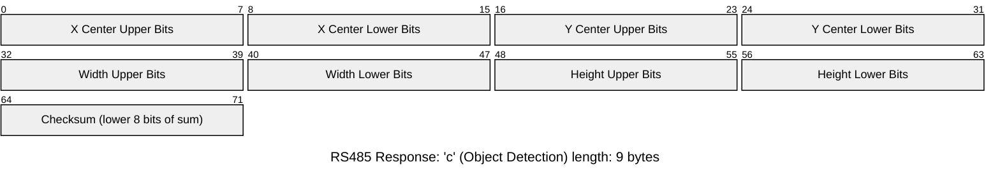

# Vex IRB Adapter

[](https://github.com/libhal/vex-irb-adapter/actions/workflows/build.yml)

This project is an adapter for the SJSU E10 Infrared Receiver Board to allow
communication with Vex 5 brain through use of a RS485 tranceiver and an RJ11
port (commonly called a smart port on Vex side). The adaptor has a QWIIC
connector which is used to communicate with the
[HuskyLens AI camera](https://www.dfrobot.com/product-1922.html).

The PCB design is open source and can be found on
[OSHWLab](https://oshwlab.com/libhal/vex-adapter). The power regulator is
purchased from [Pololu](https://www.pololu.com/product/5592) due to great value
and reliability. To enclose the adaptor and make it easier to use we designed a
[3D printed enclosure on OnShape](https://cad.onshape.com/documents/ee69ea771b3426ac97776444/w/45ac0aa7c9bd20a1984d74b6/e/4c369e0476760c7468856e8b?renderMode=0&uiState=68d6b1c8a8c68f57f9c83bdb) with heated inserts to allow quick assembly and disassembly.

The code in this repo contains the firmware for the adapter, as well as an example
and a template to be used on the Vex located in the `/vex-code/` folder. The files in the vex-code
folder are to be used in the [Vex Web Editor](https://codev5.vex.com/) or in VS Code with the
[VEX extension](https://www.vexrobotics.com/vexcode/vscode-extension).

## Getting Started (Writing Code for Vex)

To get access to the starter files on your computer you can download everything
by clicking the Green `🟩 Code <>` drop down button on the top of the page, and
navigate to the `Download Zip` button to download a zip of this project.

### Using CodeV5 by VEX (RECOMMENDED)

> [!IMPORTANT]
> To use this tool, you **MUST** use a Chrome based browser:
>
> - Google Chrome
> - Chromium
> - Microsoft Edge
> - Opera GX (supports WebSerial)

Here is a link to the web based development software:
[CodeV5 By Vex](https://codev5.vex.com/). To open the starter project navigate,
from the web interface, select "File" then "Open" then navigate to the location
where you installed this project and open the `vex-code/` folder and select `template.v5cpp`.

The downward facing arrow next to `#pragma region IRB Adapter Code` can be clicked to collapse the helper
class for a cleaner view.


### Using Visual Studio Code (VSCode)

You can also use [Visual Studio Code](https://code.visualstudio.com/) to write
software for the VEX5 Brain.

- Install the [Vex Robotics](https://marketplace.visualstudio.com/items?itemName=VEXRobotics.vexcode) extension.
- Open the Vex extension tab in VSCode and select "Import Project"
- Find the downloaded project and select `template.v5cpp`.

## Requesting and Receiving Data With Helper Code

The template provides a helper class and functions to assist in asking for data
from the adapter. They each return a struct containing the needed data and are
further explained below.

#### Low Frequency IR Data

Function Call:

```c++
// defaults to 0 in case of bad read
struct low_freq_data {
  uint8_t strongest_photo_diode = 0; // from diode 0 to 7
  uint8_t intensity = 0; // from 0 to 127
};

const int port_number = 1;
irb_adapter::adapter board(port_number);
low_freq_data data = board.get_low_freq_data();
```

#### High Frequency IR Data

```c++
// defaults to 0 in case of bad read
struct hi_freq_data {
  uint8_t strongest_photo_diode = 0; // from diode 0 to 7
  uint8_t intensity = 0; // from 0 to 127
};

const int port_number = 1;
irb_adapter::adapter board(port_number); // using port 1 (can be changed)
auto data = board.get_hi_freq_data();
```

### AI Camera Data

```c++
// defaults to 0 in case of bad read or no object detected
struct camera_data {
  uint16_t x_center = 0;
  uint16_t y_center = 0;
  uint16_t width = 0;
  uint16_t height = 0;
};

const int port_number = 1;
irb_adapter::adapter board(port_number);
auto data = board.get_cam_data();
```

### Example Data Usage

```c++
const int port_number = 1;
irb_adapter::adapter board(port_number);

while (true) {
  auto data = board.get_hi_freq_data();
  auto strongest_photo_diode_number = data.strongest_photo_diode;
  // TODO: add print statement here.
}
```

## Programming the Adapter

> [!NOTE]
> If an adapter has been provided to you by an instructor of your class, such
> as the E10 course at San Jose State University, then the device has been
> pre-programmed and should work out of the box. If the device does not work
> report it to your instructor and request a replacement if one exists.

Adapters must be programmed in order to work properly. We **highly recommend**
using the Web Flasher method for programming the devices as it is the most
straight forward. The USB-C port to program the device is covered by the
top case. To remove the top case cover, locate the three screws on the bottom
of the case, and unscrewed them. The top should come off with the board still
connected to the bottom of the case.


### Programming Adapter Via Web Programmer (Recommended)

Programming using the Web Programmer requires a chrome based browser.

To program the device:

1. Connect adapter to computer via USB-C port and go to the [E10 adapter web programmer](https://libhal.github.io/vex-irb-adapter/).
2. Click the connect and flash button and select the adapter in the pop-up.
3. Wait until device is fully flashed, then you are free to disconnect device and use.

> [!TIP]
> If you are unsure which device to choose, unplug and re-plug the adapter in
> while the pop-up is open.

### Building and Flashing Manually

You will need experience working with a terminal (also called command line) in
order to build manually.

Before getting started, if you haven't used libhal before, follow the
[Getting Started](https://libhal.github.io/latest/getting_started/) guide.

Clone or download the repo, then `cd` into the repo from a terminal.

#### 📥 Setup

Conan is the package manager used for this application. We typically install conan via `pipx`

```bash
pipx install conan>=2.16.0
```

With conan installed, you can run the following setup:

```bash
conan config install https://github.com/libhal/conan-config2.git
conan hal setup
```

If both of those commands were successful, you are now ready to build the application

#### 📦 Building Application

```bash
conan build adapter-firmware -pr:a hal/tc/gcc -pr:h hal/mcu/stm32f103c8
```

#### ⚡ Flashing device

```bash
stm32loader -e -w -v -B -p <device com> build/stm32f103c8/MinSizeRel/app.elf.bin
```

Replace `<device com>` with the path to your serial port for your system. On
Windows its called `COM1`, `COM2`, ..., `COMN`. On UNIX based systems like Linux
and Mac the serial devices are files located in `/dev/`, typicaly written as
`/dev/ttyUSB0` or `/dev/ttyACM0` for Linux and `/dev/tty.serial______` in mac
but the `______` is replaced with a serial number.

## Advanced Details

### Communication Protocol

The Vex adapter communicates with the Husky AI Camera using a simple I2C protocol.
The host (e.g., Vex code) sends a single byte to request data. The camera responds
with a fixed-length byte stream containing sensor data and a checksum. The
checksum  is computed as the **8-bit sum of all received bytes**
(modulo 256). If the checksum does not match, the data is considered corrupted, and
should be discarded by the VEX controller. The VEX control may make another request
in order to get proper data.

### Request: Low-Frequency IR Reading (`l`)

Requests the photo diode with the highest intensity from low-frequency IR sensors.


### Request: High-Frequency IR Reading (`h`)

Requests the photo diode with the highest intensity from high-frequency IR sensors.


### Request: Object Detection Data (`c`)

Requests object detection data (center coordinate, bounding box width, bounding box height) from the camera.


