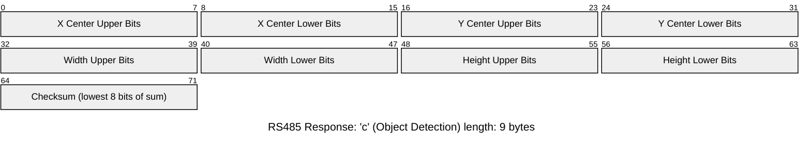

# E10 Adapter Firmware

> [!NOTE]
> If an adapter has been provided to you by an instructor of your class, such
> as the E10 course at San Jose State University, then the device has been
> pre-programmed and should work out of the box. If the device does not work
> report it to your instructor and request a replacement if one exists.

Adapters must be programmed in order to work properly. We **highly recommend**
using the Web Flasher method for programming the devices as it is the most
straight forward. The USB-C port to program the device is covered by the
top case. To remove the top case cover, locate the three screws on the bottom
of the case, and unscrewed them. The top should come off with the board still
connected to the bottom of the case.


## Programming Adapter Via Web Programmer (Recommended)

Programming using the Web Programmer requires a chrome based browser.

To program the device:

1. Connect adapter to computer via USB-C port and go to the [E10 adapter web programmer](https://libhal.github.io/vex-irb-adapter/).
2. Click the connect and flash button and select the adapter in the pop-up.
3. Wait until device is fully flashed, then you are free to disconnect device and use.

> [!TIP]
> If you are unsure which device to choose, unplug and re-plug the adapter in
> while the pop-up is open.

## Building and Flashing Manually

You will need experience working with a terminal (also called command line) in
order to build manually.

Before getting started, if you haven't used libhal before, follow the
[Getting Started](https://libhal.github.io/latest/getting_started/) guide.

Clone or download the repo, then `cd` into the repo from a terminal.

### 📥 Setup

Conan is the package manager used for this application. We typically install conan via `pipx`

```bash
pipx install conan>=2.16.0
```

With conan installed, you can run the following setup:

```bash
conan config install https://github.com/libhal/conan-config2.git
conan hal setup
```

If both of those commands were successful, you are now ready to build the application

### 📦 Building Application

```bash
conan build adapter-firmware -pr:a hal/tc/gcc -pr:h hal/mcu/stm32f103c8
```

### ⚡ Flashing device

```bash
stm32loader -e -w -v -B -p <device com> build/stm32f103c8/MinSizeRel/app.elf.bin
```

Replace `<device com>` with the path to your serial port for your system. On
Windows its called `COM1`, `COM2`, ..., `COMN`. On UNIX based systems like Linux
and Mac the serial devices are files located in `/dev/`, typicaly written as
`/dev/ttyUSB0` or `/dev/ttyACM0` for Linux and `/dev/tty.serial______` in mac
but the `______` is replaced with a serial number.

## Advanced Details

### Communication Protocol

The Vex adapter communicates with the Husky AI Camera using a simple I2C
protocol. The host (e.g., Vex code) sends a single byte to request data. The
camera responds with a fixed-length byte stream containing sensor data and a
checksum. The checksum  is computed as the **8-bit sum of all received bytes**
(modulo 256). If the checksum does not match, the data is considered corrupted,
and should be discarded by the VEX controller. The VEX control may make another
request in order to get proper data.

### Request: Low-Frequency IR Reading (`l`)

Requests the photo diode with the highest intensity from low-frequency IR sensors.


### Request: High-Frequency IR Reading (`h`)

Requests the photo diode with the highest intensity from high-frequency IR
sensors.


### Request: Object Detection Data (`c`)

Requests object detection data (center coordinate, bounding box width, bounding
box height) from the camera.


